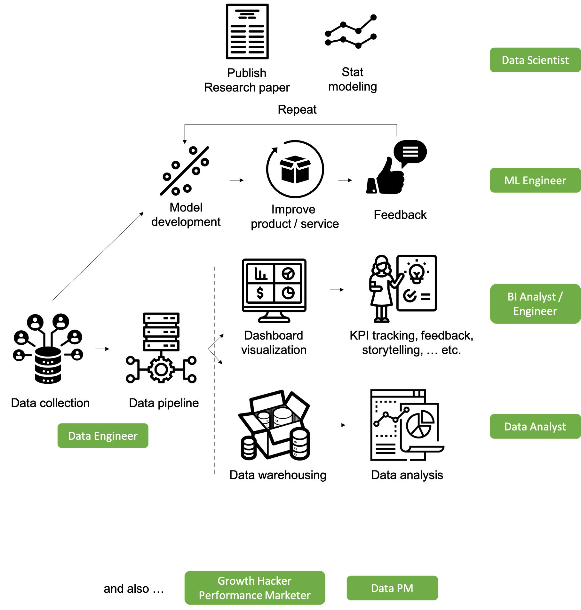

<link rel="stylesheet" href="styles.css" type="text/css">

   

---
title: "데이터 관련 직군"
---

### 데이터 직군 소개

많은 분들이 미국 석사 후에 현지 취업을 목표로 삼고 있는데요. 미국의 데이터 직군 취업시장이 어떻게 나누어져 있는지를 파악하는 것이 중요합니다. 각 position마다 요구하는 skill sets들에 차이가 있기 때문에, 목표로 하는 position에 알맞는 전공과 프로그램을 선택하시는 것이 현지 취업의 확률을 높이는 첫걸음이라고 볼 수 있습니다.

미국에서 학부를 마친 유학생들도 좀 더 나은 커리어를 위하여 1-2년 정도의 Master's program을 통해서 좀 더 좋은 회사와 대우를 받으려고 노력하는 추세이고, 이미 현직에 계신분들도 여러 가지 이유로 Data 관련 석사나 Bootcamp 등을 통해서 커리어 부스팅을 노리시는 경우를 많이 보고 있습니다.

앞서 말씀드린 것처럼, 회사마다 title은 같지만 하는 일이 매우 상이합니다. 따라서, 본인이 노리는 직군에 알맞은 석사 프로그램에 진학하여서 job에서 요구하는 skill set들을 배우시는 것이 중요합니다.

아래 그림을 참고 하셔서 내가 기존의 경험과 조합하여 어떤 데이터 직군이 적합할지를 판단을 내리고 준비하셔야 합니다.

  

  

### 나는 어떤 직군이 맞을까?
